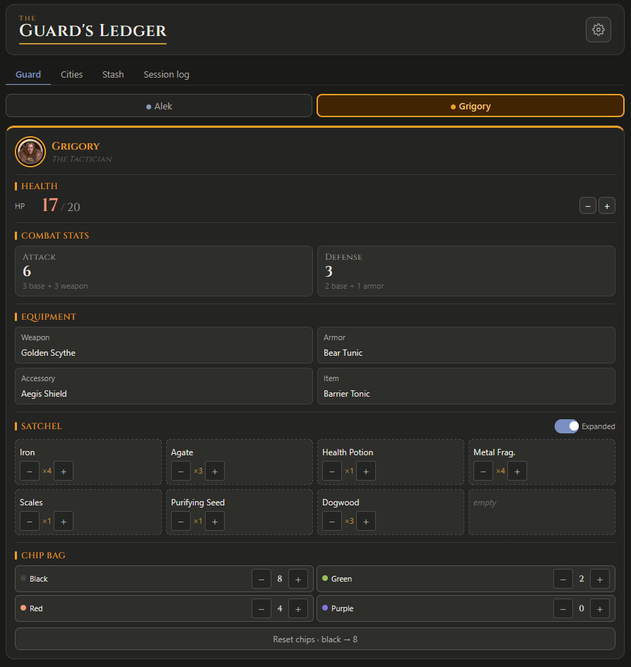

# The Guard's Ledger

> A campaign companion for *The Isofarian Guard* — tracks all per-guard and per-city state so you can focus on playing the game, not shuffling tokens.

**[→ Open the app](https://pdgrenon.github.io/guards-ledger/)**



---

## Why I built this

*The Isofarian Guard* is a beautifully complex co-op game, but the physical upkeep is relentless. Each of up to 8 guards has HP, AP, a chip bag, a satchel, equipment slots, and speaking stones with individual cooldown states. Cities track prestige across three quest types. The stash holds 60+ craftable materials. Managing all of that on paper, mid-game, while also actually playing — is genuinely painful.

I built this app to solve that problem for my own playgroup. The design goal was simple: fast to tap on a phone, never loses state between sessions, and handles the fiddly bookkeeping invisibly so the game stays front and center.

---

## Features

**Guards** — up to 8 playable (Alek, Grigory, Dasha, Zoya, Borya, Mila, Seva, Kira)
- HP and AP
- Attack and defense stats
- Equipment slots: weapon, armor, accessory, item
- Satchel (4 or 8 slots) with item names and quantities
- Chip bag counts (black, green, red, purple)

**Cities** — Mir, Razdor, Ryba, Silny, Strofa, Vouno
- Prestige pips (0–3) derived from completed activities
- Puzzle quest and two bounties per city

**Fort Istra Stash**
- Crafting material inventory across 7 categories, searchable by name

**Stonebound**
- Cube placement per location (City, Resource node, or Enemy node)
- Total cubes used vs. cap

**Campaign globals**
- Sil and Lux Essence totals with configurable step increments
- Session log of all state changes (last 100 events)

**Settings & persistence**
- All state saves to `localStorage` automatically after every action
- Export a dated JSON snapshot or import a previously saved one
- Configure max HP and starting chip counts per guard

---

## Tech notes

This project was built deliberately without any external UI or state management libraries. A few specific choices worth explaining:

**Single hook for all state.** Everything lives in `useGameState.js` — loading, saving, and all 30+ mutation functions. Prop drilling is the only data transport. For a self-contained app of this scope, adding Redux or Zustand would introduce indirection without benefit. The trade-off is intentional: the data flow is simple enough to read top to bottom.

**No UI library.** Every component is hand-rolled with plain CSS. This added upfront time but gave full control over touch targets, theming, and the specific interaction patterns the game requires: large tap areas, pip tracks, chip counters, cooldown toggles. A component library would have fought most of these.

**CSS custom properties for theming.** Light/dark mode is handled entirely via `prefers-color-scheme` and a small set of semantic variables (`--c-bg`, `--c-text`, `--c-accent`, etc.). Single stylesheet, easy to diff.

**Stack:** React 19 · Vite · Plain CSS · GitHub Actions → GitHub Pages

---

## Getting started

```bash
npm install
npm run dev       # http://localhost:5173/guards-ledger/
```

```bash
npm run build     # Production build → dist/
npm run preview   # Preview production build locally
npm run lint      # ESLint
npm run deploy    # Build + publish to GitHub Pages
```

---

## License

MIT
